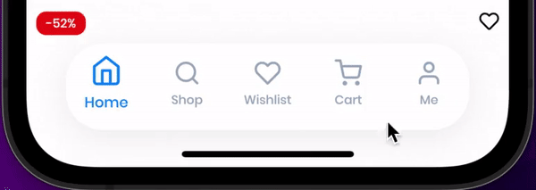

# Awesome Bottom Bar


## the app uses awesome bottom bar

| IOS  | Android |
| ------------- | ------------- |
| [IOS](https://apps.apple.com/vn/app/cirilla-store/id1498754090?l=vi)  | [Android](https://play.google.com/store/apps/details?id=io.rnlab.cirilla)  |

## Styles

| background  | borderBottom |
| ------------- | ------------- |
|   |   |

| borderTop | creativeHexagon |
| ------------- | ------------- |
|   |   |

| creative | default |
| ------------- | ------------- |
|   |   |

| fancyBorder | fancyDot |
| ------------- | ------------- |
|   |   |

| floating | inspiredInside |
| ------------- | ------------- |
|   |   |

| inspiredInsideHexagon | inspiredOutSide |
| ------------- | ------------- |
|   |   |

| inspiredOutsideDeep | inspiredOutSideHexagon |
| ------------- | ------------- |
|   |   |

| inspiredOutsideRadius | inspiredTopHexagon |
| ------------- | ------------- |
|   |   |

| inspiredTop | salomon |
| ------------- | ------------- |
|   |   |


## Getting Started

In your flutter project add the dependency:

```yaml
dependencies:
  awesome_bottom_bar: any
```

Import the package:

```dart
import 'package:awesome_bottom_bar/awesome_bottom_bar.dart';
import 'package:awesome_bottom_bar/widgets/inspired/inspired.dart';
```

Example

```dart
import 'package:awesome_bottom_bar/widgets/inspired/inspired.dart';
import 'package:example/bottom_bar_creative.dart';
import 'package:example/bottom_bar_default.dart';
import 'package:example/bottom_bar_fancy.dart';
import 'package:example/bottom_bar_salomon.dart';
import 'package:flutter/material.dart';
import 'package:awesome_bottom_bar/awesome_bottom_bar.dart';

const List<TabItem> items = [
  TabItem(
    icon: Icons.home,
    // title: 'Home',
  ),
  TabItem(
    icon: Icons.search_sharp,
    title: 'Shop',
  ),
  TabItem(
    icon: Icons.favorite_border,
    title: 'Wishlist',
  ),
  TabItem(
    icon: Icons.shopping_cart_outlined,
    title: 'Cart',
  ),
  TabItem(
    icon: Icons.account_box,
    title: 'profile',
  ),
];

void main() {
  runApp(const MyApp());
}

class MyApp extends StatelessWidget {
  const MyApp({Key? key}) : super(key: key);

  // This widget is the root of your application.
  @override
  Widget build(BuildContext context) {
    return MaterialApp(
      title: 'Flutter Demo',
      theme: ThemeData(
        primarySwatch: Colors.blue,
      ),
      home: const MyHomePage(title: 'Flutter Demo Home Page'),
    );
  }
}

class MyHomePage extends StatefulWidget {
  const MyHomePage({Key? key, required this.title}) : super(key: key);

  final String title;

  @override
  _MyHomePageState createState() => _MyHomePageState();
}

class _MyHomePageState extends State<MyHomePage> {
  int visit = 0;
  double height = 30;
  Color colorSelect =const Color(0XFF0686F8);
  Color color = const Color(0XFF7AC0FF);
  Color color2 = const Color(0XFF96B1FD);
  Color bgColor = const  Color(0XFF1752FE);
  @override
  Widget build(BuildContext context) {
    return Scaffold(
      appBar: AppBar(
        title: Text(widget.title),
      ),
      body: SingleChildScrollView(
        padding:const EdgeInsets.symmetric(vertical: 20),
        child: Column(
          children: [
            SizedBox(height: height),
            BottomBarInspiredOutside(
              items: items,
              backgroundColor: bgColor,
              color: color2,
              colorSelected: Colors.white,
              indexSelected: visit,
              onTap: (int index) => setState(() {
                visit = index;
              }),
              top: -25,
              animated: true,
              itemStyle: ItemStyle.hexagon,
              chipStyle:const ChipStyle(drawHexagon: true),
            ),
            SizedBox(height: height),
            BottomBarInspiredOutside(
              items: items,
              backgroundColor: bgColor,
              color: color2,
              colorSelected: Colors.white,
              indexSelected: visit,
              onTap: (int index) => setState(() {
                visit = index;
              }),
              top: -28,
              animated: false,
              itemStyle: ItemStyle.circle,
              chipStyle:const ChipStyle(notchSmoothness: NotchSmoothness.sharpEdge),
            ),
            SizedBox(height: height),
            BottomBarInspiredOutside(
              items: items,
              backgroundColor: bgColor,
              color: color2,
              colorSelected: Colors.white,
              indexSelected: visit,
              onTap: (int index) => setState(() {
                visit = index;
              }),
              top: -28,
              animated: false,
              itemStyle: ItemStyle.circle,
              chipStyle:const ChipStyle(notchSmoothness: NotchSmoothness.smoothEdge),
            ),
            SizedBox(height: height),
            BottomBarInspiredOutside(
              items: items,
              backgroundColor: bgColor,
              color: color2,
              colorSelected: Colors.white,
              indexSelected: visit,
              onTap: (int index) => setState(() {
                visit = index;
              }),
              top: -28,
              animated: false,
              itemStyle: ItemStyle.circle,
              chipStyle:const ChipStyle(notchSmoothness: NotchSmoothness.verySmoothEdge),
            ),
            SizedBox(height: height),
            BottomBarInspiredOutside(
              items: items,
              backgroundColor: bgColor,
              color: color2,
              colorSelected: Colors.white,
              indexSelected: visit,
              onTap: (int index) => setState(() {
                visit = index;
              }),
              top: -28,
              animated: false,
              itemStyle: ItemStyle.circle,
            ),
            SizedBox(height: height),
            BottomBarInspiredInside(
              items: items,
              backgroundColor: bgColor,
              color: color2,
              colorSelected: Colors.white,
              indexSelected: visit,
              onTap: (int index) => setState(() {
                visit = index;
              }),
              chipStyle:const ChipStyle(convexBridge: true),
              itemStyle: ItemStyle.circle,
              animated: false,
            ),
            SizedBox(height: height),
            BottomBarInspiredInside(
              items: items,
              backgroundColor: bgColor,
              color: color2,
              colorSelected: Colors.white,
              indexSelected: visit,
              onTap: (int index) => setState(() {
                visit = index;
              }),
              animated: false,
              chipStyle:const ChipStyle(isHexagon: true, convexBridge: true),
              itemStyle: ItemStyle.hexagon,
            ),
            BottomBarFloating(
              items: items,
              backgroundColor: bgColor,
              color: color2,
              colorSelected: Colors.white,
              indexSelected: visit,
              onTap: (int index) => setState(() {
                visit = index;
              }),
            ),
            SizedBox(height: height),
            BottomBarCreative(
              items: items,
              backgroundColor: Colors.green.withOpacity(0.21),
              color: color,
              colorSelected: colorSelect,
              indexSelected: visit,
              onTap: (int index) => setState(() {
                visit = index;
              }),
            ),
            SizedBox(height: height),
            BottomBarCreative(
              items: items,
              backgroundColor: Colors.green.withOpacity(0.21),
              color: color,
              colorSelected: colorSelect,
              indexSelected: visit,
              highlightStyle:const HighlightStyle(
                isHexagon: true,
              ),
              onTap: (int index) => setState(() {
                visit = index;
              }),
            ),
            SizedBox(height: height),
            BottomBarCreative(
              items: items,
              backgroundColor: Colors.green.withOpacity(0.21),
              color: color,
              colorSelected: colorSelect,
              indexSelected: visit,
              isFloating: true,
              onTap: (int index) => setState(() {
                visit = index;
              }),
            ),
            SizedBox(height: height),
            BottomBarCreative(
              items: items,
              backgroundColor: Colors.green.withOpacity(0.21),
              color: color,
              colorSelected: colorSelect,
              indexSelected: visit,
              isFloating: true,
              highlightStyle:const HighlightStyle(sizeLarge: true, background: Colors.red, elevation: 3),
              onTap: (int index) => setState(() {
                visit = index;
              }),
            ),
            SizedBox(height: height),
            BottomBarCreative(
              items: items,
              backgroundColor: Colors.green.withOpacity(0.21),
              color: color,
              colorSelected: colorSelect,
              indexSelected: visit,
              isFloating: true,
              highlightStyle:const HighlightStyle(sizeLarge: true, isHexagon: true, elevation: 2),
              onTap: (int index) => setState(() {
                visit = index;
              }),
            ),
            SizedBox(height: height),
            BottomBarInspiredFancy(
              items: items,
              backgroundColor: Colors.green.withOpacity(0.21),
              color: color,
              colorSelected: colorSelect,
              indexSelected: visit,
              onTap: (int index) => setState(() {
                visit = index;
              }),
            ),
            SizedBox(height: height),
            BottomBarInspiredFancy(
              items: items,
              backgroundColor: Colors.green.withOpacity(0.21),
              color: color,
              colorSelected: colorSelect,
              indexSelected: visit,
              styleIconFooter: StyleIconFooter.dot,
              onTap: (int index) => setState(() {
                visit = index;
              }),
            ),
            SizedBox(height: height),
            BottomBarDefault(
              items: items,
              backgroundColor: Colors.green,
              color: Colors.white,
              colorSelected: Colors.orange,
              onTap: (int index) => setState(() {
                visit = index;
              }),
            ),
            SizedBox(height: height),
            BottomBarDefault(
              items: items,
              backgroundColor: Colors.green,
              color: Colors.white,
              colorSelected: Colors.orange,
              onTap: (int index) => avoidPrint('$index'),
              blur: 50,
              countStyle:const CountStyle(
                background: Colors.brown,
              ),
            ),
            SizedBox(height: height),
            BottomBarDefault(
              items: items,
              backgroundColor: Colors.green,
              color: Colors.white,
              colorSelected: Colors.orange,
              iconSize: 40,
              indexSelected: visit,
              titleStyle:const TextStyle(fontSize: 18, color: Colors.black),
              onTap: (int index) => setState(() {
                visit = index;
              }),
            ),
            SizedBox(height: height),
            BottomBarDefault(
              items: items,
              backgroundColor: Colors.green,
              color: Colors.white,
              colorSelected: Colors.orange,
              indexSelected: visit,
              paddingVertical: 25,
              onTap: (int index) => setState(() {
                visit = index;
              }),
            ),
            SizedBox(height: height),
            BottomBarDivider(
              items: items,
              backgroundColor: Colors.amber,
              color: Colors.grey,
              colorSelected: Colors.blue,
              indexSelected: visit,
              onTap: (index) => setState(() {
                visit = index;
              }),
              styleDivider: StyleDivider.bottom,
              countStyle:const CountStyle(
                background: Colors.white,
                color: Colors.purple,
              ),
            ),
            SizedBox(height: height),
            BottomBarSalomon(
              items: items,
              color: Colors.blue,
              backgroundColor: Colors.white,
              colorSelected: Colors.white,
              backgroundSelected: Colors.blue,
              borderRadius: BorderRadius.circular(0),
              indexSelected: visit,
              onTap: (index) => setState(() {
                visit = index;
              }),
            ),
          ],
        ),
      ),
      bottomNavigationBar: Container(
        padding:const EdgeInsets.only(bottom: 30, right: 32, left: 32),
        child: BottomBarFloating(
          items: items,
          backgroundColor: Colors.green,
          color: Colors.white,
          colorSelected: Colors.orange,
          indexSelected: visit,
          paddingVertical: 24,
          onTap: (int index) => setState(() {
            visit = index;
          }),
        ),
      ),
    );
  }
}
```
For better understanding, refer to the [example project](https://github.com/AppCheap/awesome_drawer_bar/tree/master/example) in the official git repo.

## Issues

Please file any issues, bugs or feature request as an issue on our [GitHub](https://github.com/AppCheap/awesome_bottom_bar/issues) page.

## Want to contribute

If you would like to contribute to the plugin (e.g. by improving the documentation, solving a bug or adding a cool new feature), please carefully review our [contribution guide](CONTRIBUTING.md) and send us your [pull request](https://github.com/AppCheap/awesome_bottom_bar/pulls).
